<p align="center">
  
</p>

<h1 align="center">Xenolinguist</h1>

<p align="center">
  <strong>A local-first desktop workbench for decoding unknown languages</strong><br/>
  <em>From the first sample to the first sentence — everything runs offline on your machine.</em>
</p>

<p align="center">
  <a href="https://github.com/Parusann/Xenolinguist/releases/latest"></a>
  
  
  
  
  
  
</p>

<p align="center">
  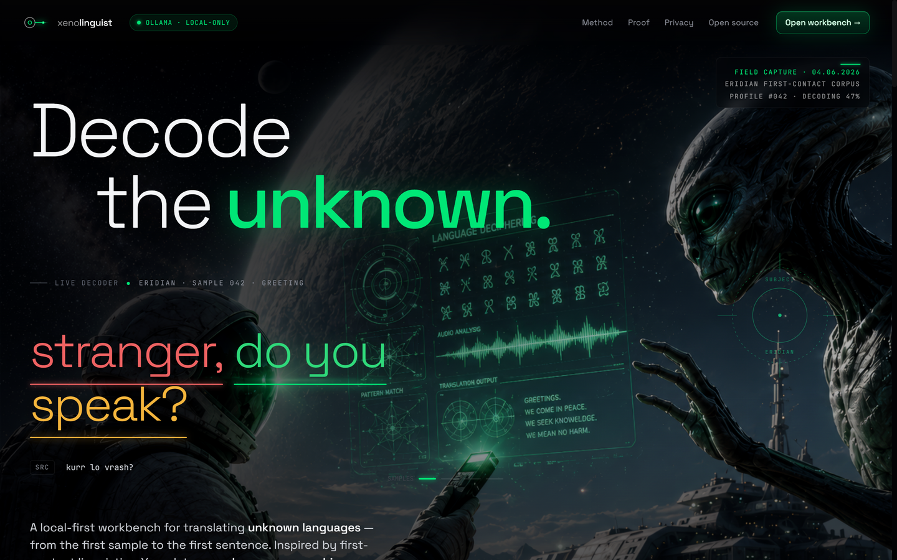
</p>

Xenolinguist is a desktop app for **decoding a language you have no key to** — alien,
constructed, or obscure. It turns the methodology of first-contact linguistics into a
tool: capture raw samples, crack the number system, build a dictionary, infer grammar,
and translate — with a **local LLM, audio playback, speech-to-text, and phonetic
transcription** assisting the whole way. Nothing leaves your machine: all AI runs through
a local **Ollama** model and all voice processing uses bundled binaries. No account, no cloud.

---

## ⬇ Download

> **[Download for Windows (v1.0.0)](https://github.com/Parusann/Xenolinguist/releases/latest/download/Xenolinguist-Setup-1.0.0.exe)**  ·  Try the landing page live at **[parusann.github.io/Xenolinguist](https://parusann.github.io/Xenolinguist/)**

- **Windows 10 / 11, 64-bit.** Download, run the installer, and you're decoding.
- **Unsigned build** — Windows SmartScreen will warn "unknown publisher." Click
  **More info → Run anyway.** It's [open source for inspection](https://github.com/Parusann/Xenolinguist).
- **AI features** (translation, field notes, suggestions) use a free, local
  [Ollama](https://ollama.com) model — install it and the rest of the workbench works offline without it.

<p align="center">
  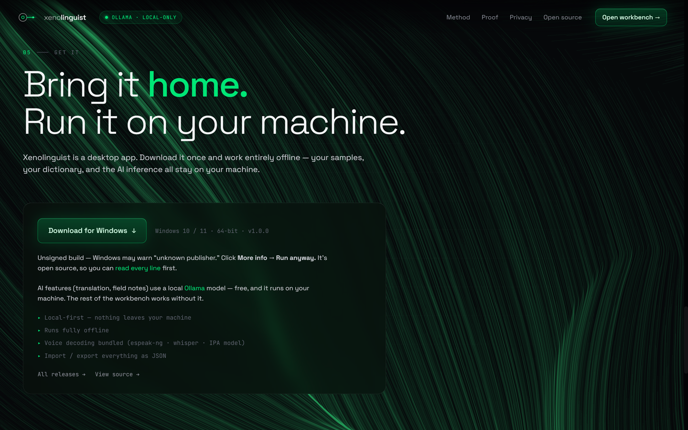
</p>

---

## The six-phase decoding workflow

Every unknown language is cracked the same way. Xenolinguist turns that loop into six
phases (jump between them with keys **1–6**), each building on the last.

| # | Phase | What you do |
|---|-------|-------------|
| 1 | **Samples** | Capture raw alien text; tag the source, add phonetic notes, attach & transcribe audio. |
| 2 | **Numbers** | Map number words to integers and **detect the base** — the Rosetta Stone of any new language. |
| 3 | **Vocabulary** | Build a living dictionary; every entry carries a 0–100 confidence, part of speech, context, and examples. |
| 4 | **Grammar** | Document word-order, morphology, and structural rules — each backed by evidence. |
| 5 | **Translation** | Live word-by-word decoding, every token colored by confidence, with inline correction. |
| 6 | **Dashboard** | A "Field Log": decoding %, milestones, discovery timeline, AI notes, and JSON/CSV import-export. |

<p align="center">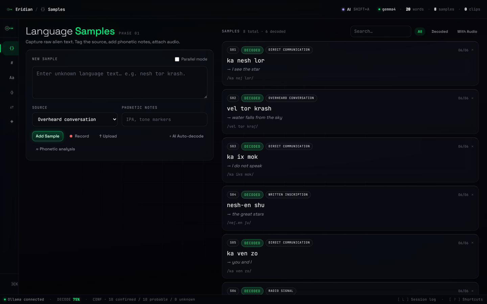<br/><em>Phase 1 · Samples — capture raw text & audio, auto-decode against the dictionary</em></p>
<p align="center">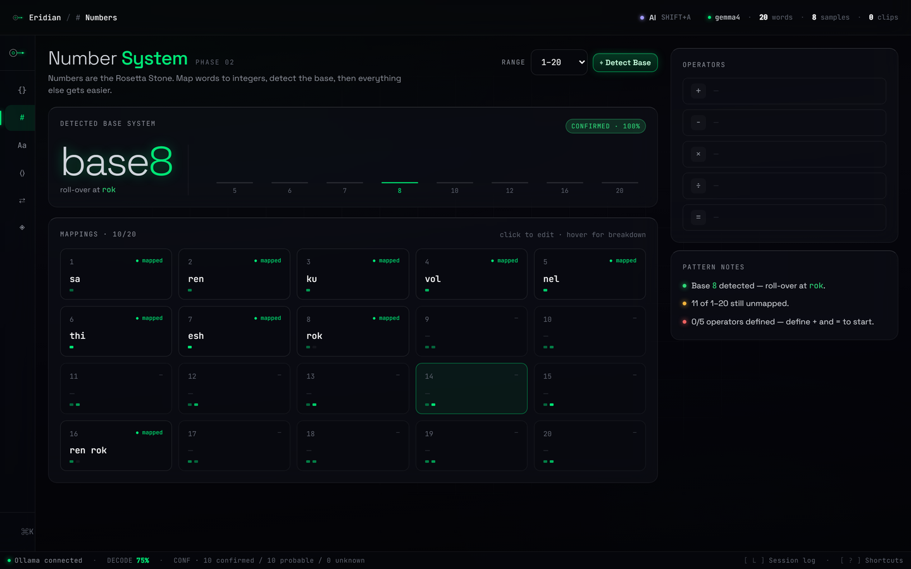<br/><em>Phase 2 · Numbers — map number words and auto-detect the base (Eridian is base-8)</em></p>
<p align="center">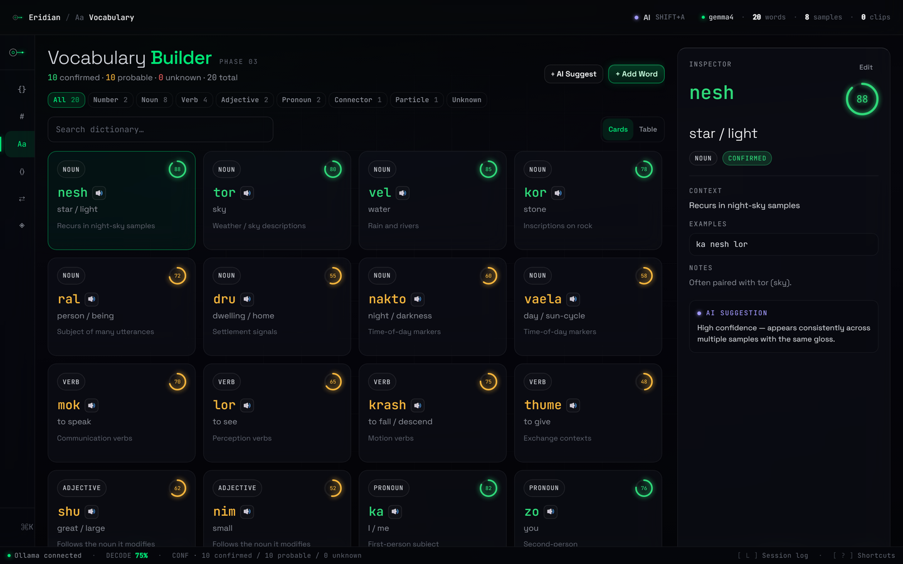<br/><em>Phase 3 · Vocabulary — a confidence-bucketed dictionary with a per-word inspector</em></p>
<p align="center">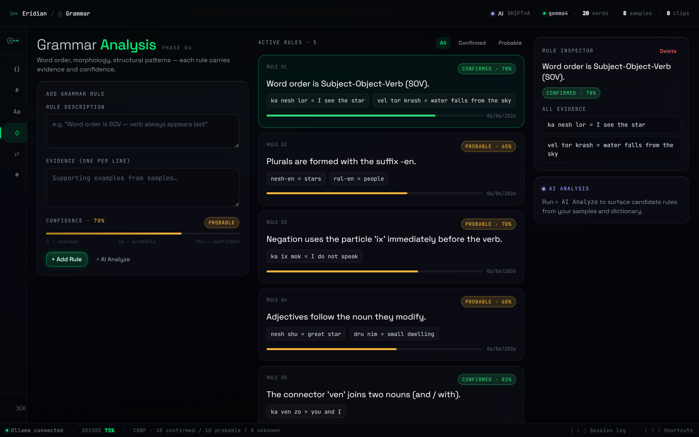<br/><em>Phase 4 · Grammar — evidence-backed structural rules with confidence scores</em></p>
<p align="center">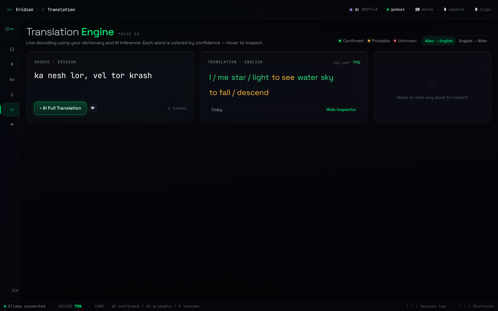<br/><em>Phase 5 · Translation — live word-by-word decoding, each token colored by confidence</em></p>
<p align="center">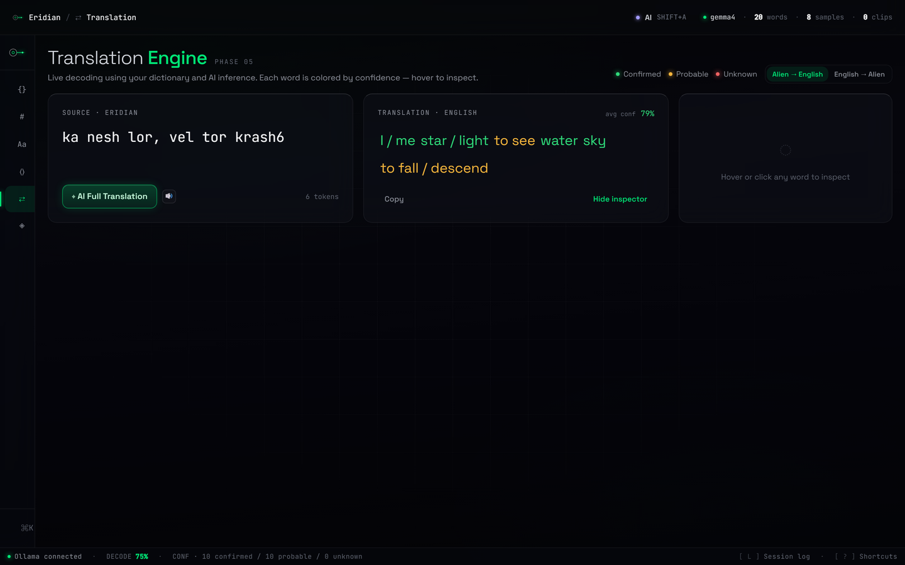<br/><em>Phase 6 · Dashboard — decoding progress, confidence distribution, milestones, field notes</em></p>

---

## Features

### 🎙 Voice subsystem — fully local
Drop in field recordings and decode them by ear and eye:
- **Text-to-speech** — hear any word or sentence rendered by bundled **espeak-ng** (browser-speech fallback when unavailable).
- **Speech-to-text** — bundled **whisper.cpp** transcribes recordings, with **honesty gating**: results are labeled *transcription* vs *phonetic-guess* so hallucinated text on alien audio is never presented as fact.
- **Phonetic / IPA recognition** — an in-process **wav2vec2 CTC** model emits time-aligned phones that seed the audio segmenter and feed the LLM.

### 🤖 Local AI (Ollama)
All inference is local and private. Streaming responses (SSE), automatic **heavy/light
model routing** per task, an AI chat panel primed with your dictionary/grammar/samples,
and background pattern suggestions as you work.

### 🧪 Sandbox mode
Not ready for a real language? The AI generates a synthetic conlang with **hidden rules**,
then walks you through decoding it — Number Discovery → Word Mapping → Sentence Decoding →
Grammar Revelation — across Easy / Medium / Hard difficulties.

### 🎛 Confidence everywhere
Every word, rule, and translation carries a **0–100 score** (≥76 confirmed · ≥41 probable ·
below that unknown), surfaced through color and weight so you always know how solid the decode is.

<p align="center">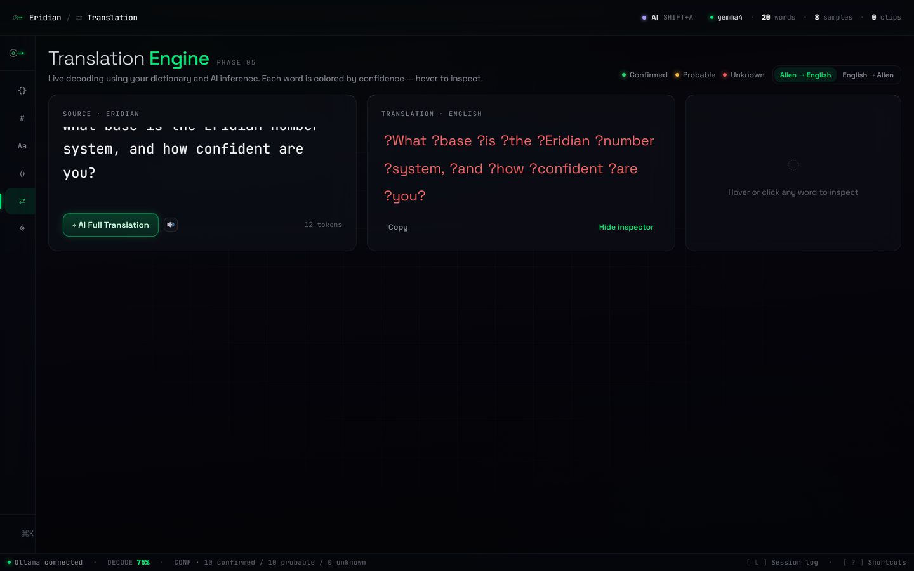<br/><em>The Decoder AI panel — a local model reasoning over your corpus, in context</em></p>
<p align="center">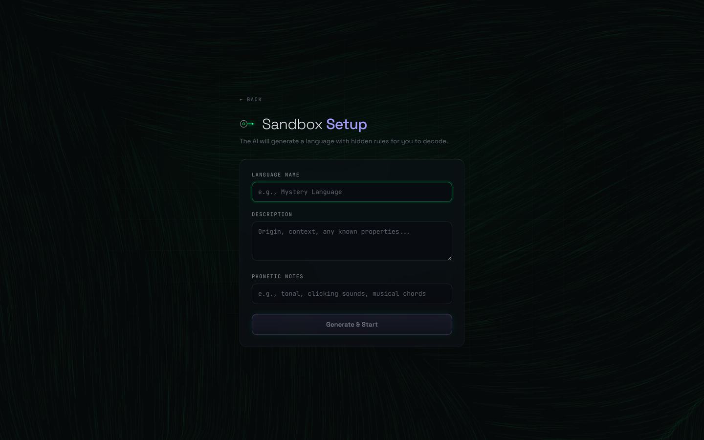<br/><em>Sandbox — generate a hidden-rule language and practice decoding from scratch</em></p>
<p align="center"><br/><em>Command palette (Ctrl/Cmd+K) — jump to any phase, tool, word, or sample</em></p>

---

## How it works

```
samples ──▶ numbers ──▶ vocabulary ──▶ grammar ──▶ translation ──▶ dashboard
  │ raw text   │ crack       │ build the    │ infer      │ decode        │ review &
  │ + audio    │ the base    │ dictionary   │ the rules  │ live          │ export
```

A profile (one decoded language) is one JSON file. Pick up where you left off, or
import/export the whole thing. Start from zero, load the seeded **Eridian** demo, or
let the Sandbox generate a fresh challenge.

<p align="center">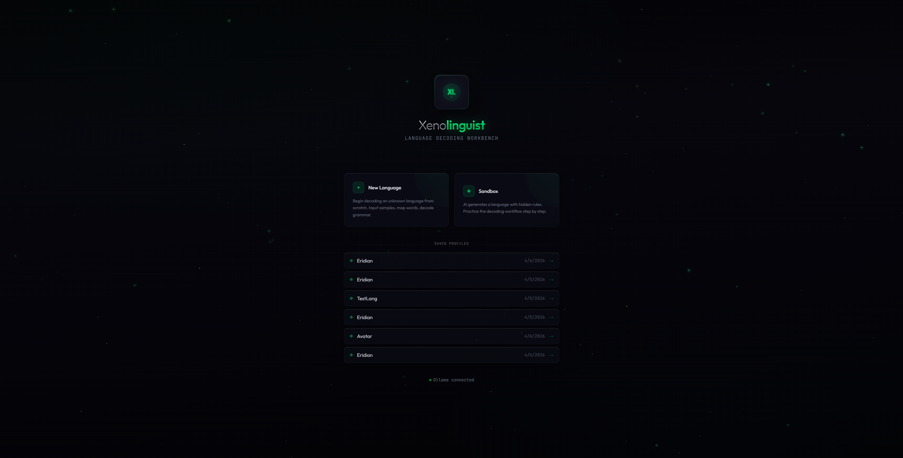<br/><em>Profile selector — your saved languages, plus New / Sandbox / Load-demo</em></p>

---

## Tech stack

| Layer | Technology |
|-------|-----------|
| **Desktop shell** | Electron 42, electron-builder (NSIS installer + auto-update) |
| **Frontend** | React 19, TypeScript, Vite 8, Tailwind CSS 4 |
| **Backend** | Node.js + Express (forked by Electron onto a loopback port) |
| **AI** | Local **Ollama** (streaming chat, per-task model routing) |
| **Voice** | espeak-ng (TTS) · whisper.cpp (STT) · Transformers.js wav2vec2 (IPA phones) |
| **Storage** | File-based JSON profiles (local) |
| **Repo** | npm-workspace monorepo — `client` / `server` / `shared` / `electron` |

---

## Build from source

> For end users, the [installer](#-download) is all you need. This section is for developers.

**Prerequisites:** Node.js 20+, and [Ollama](https://ollama.com) running with a chat model pulled.

```bash
git clone https://github.com/Parusann/Xenolinguist.git
cd Xenolinguist
npm install

# Pull a model for AI features (default is gemma4:e4b; any chat model works)
ollama pull llama3.1:8b

# Run the web app (client :5173 + API :3001)
npm run dev

# …or run the full desktop app
npm run electron:dev

# …or build the distributable installer (output in release/)
npm run dist
```

<p align="center">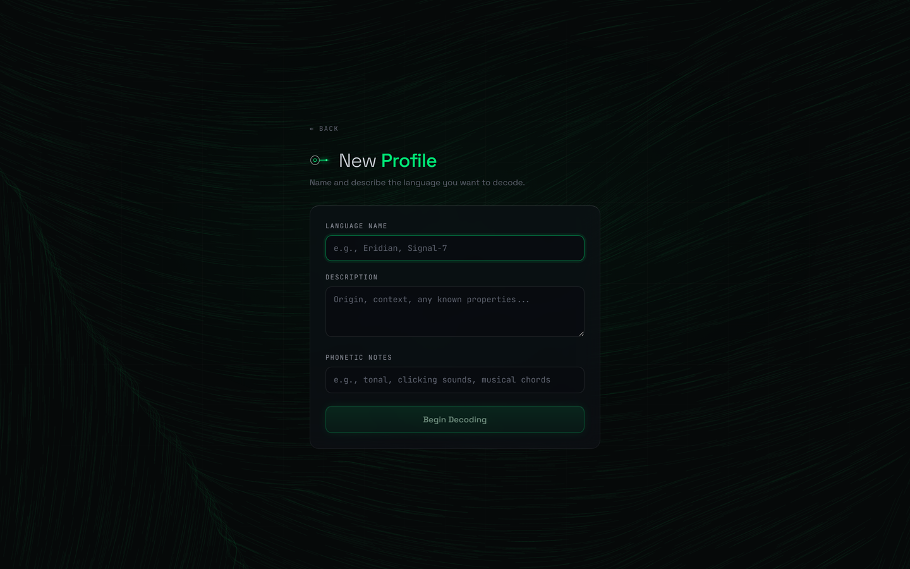<br/><em>Creating a new language profile</em></p>

### Configuration

All optional — sensible defaults are baked in (see `.env.example`).

| Variable | Default | Meaning |
|----------|---------|---------|
| `DATA_DIR` | `server/data` (dev) | Where profiles + audio are stored (Electron sets this in prod) |
| `OLLAMA_MODEL` | `gemma4:e4b` | Default model for new chats |
| `OLLAMA_BASE_URL` | `http://localhost:11434` | Ollama endpoint |
| `OLLAMA_TIMEOUT_MS` | `120000` | Per-request / per-token Ollama watchdog |
| `WHISPER_TIMEOUT_MS` | `120000` | Max wall-clock for one whisper run |
| `TTS_TIMEOUT_MS` | `30000` | Max wall-clock for one espeak run |
| `PORT` | `3001` | API port (`0` = OS-assigned, used in prod) |
| `ESPEAK_PATH` / `WHISPER_BIN` / `WHISPER_MODEL` / `IPA_MODEL_DIR` | bundled (Windows) | Voice binary / model paths |

**Full HTTP API reference:** see [`docs/FEATURES.md`](docs/FEATURES.md) §14. The complete
feature reference for the whole app lives in [`docs/FEATURES.md`](docs/FEATURES.md).

---

## Project structure

```
Xenolinguist/
├── client/            # React SPA (Vite)
│   └── src/components/
│       ├── marketing/        # the public landing / download page
│       ├── landing/          # profile selector + setup
│       ├── layout/           # shell, sidebar, command palette, AI chat, tour
│       ├── phase1-samples … phase6-dashboard/
│       ├── sandbox/          # AI-generated practice language
│       └── audio/            # recorder, player, waveform, segmenter
├── server/            # Express API (profiles, ollama, ai, audio, tts, stt, ipa)
├── shared/            # types, constants, AI prompts
├── electron/          # main / preload / builder config
├── vendor/            # bundled voice binaries + IPA model
├── scripts/           # build, bundle, capture-screenshots, verify-*
└── docs/              # FEATURES.md, screenshots, design specs
```

---

## A look at the landing site

<p align="center">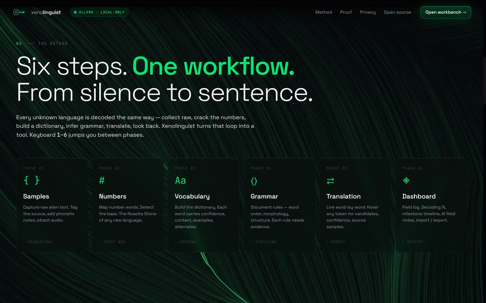</p>
<p align="center">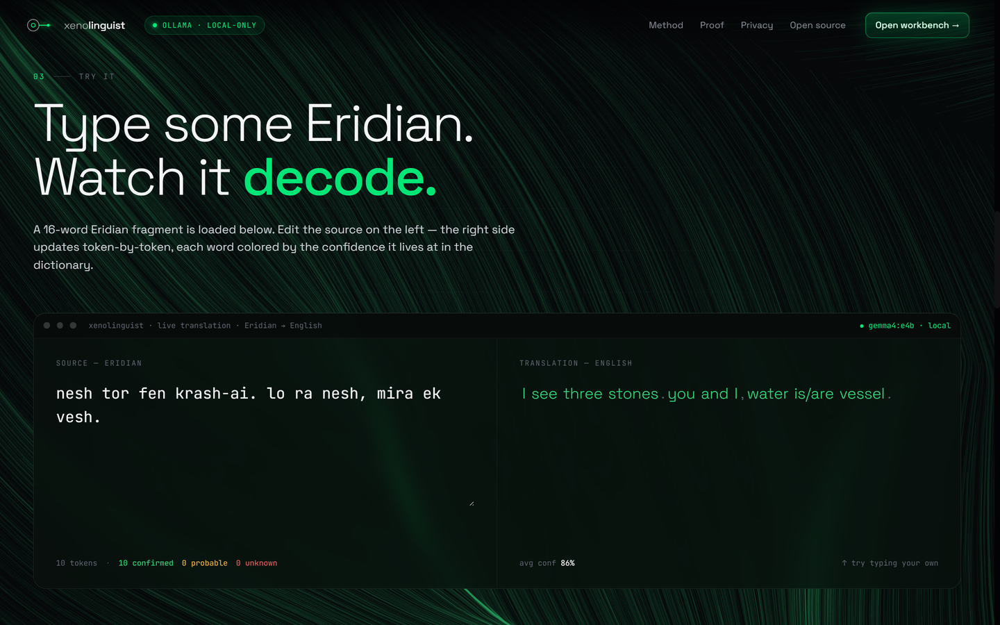</p>
<p align="center">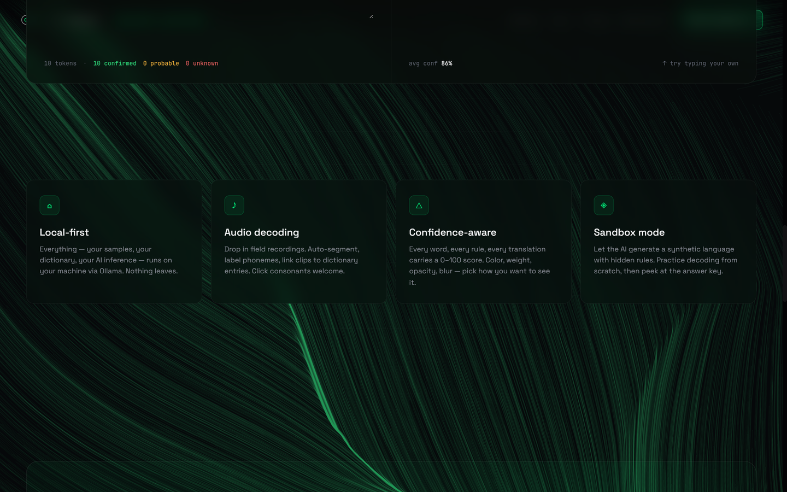</p>
<p align="center">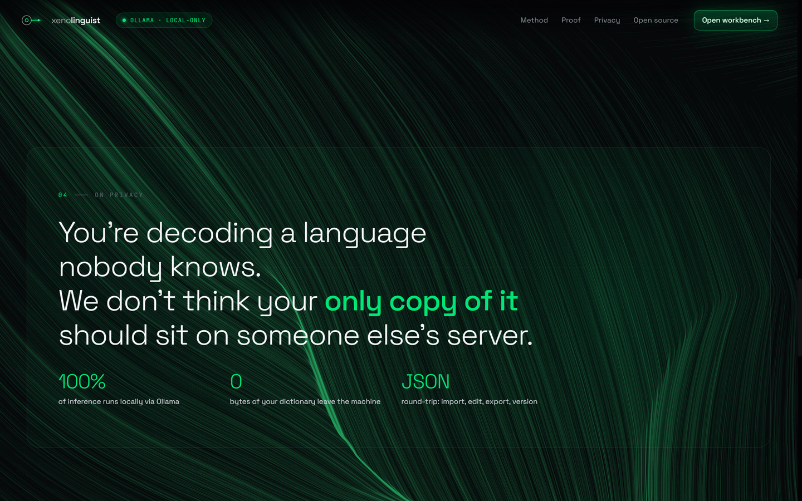</p>

---

## License

Copyright (c) 2026 Parusan Natheeswaran. All Rights Reserved.

This software is proprietary. See [LICENSE](LICENSE) for details.
