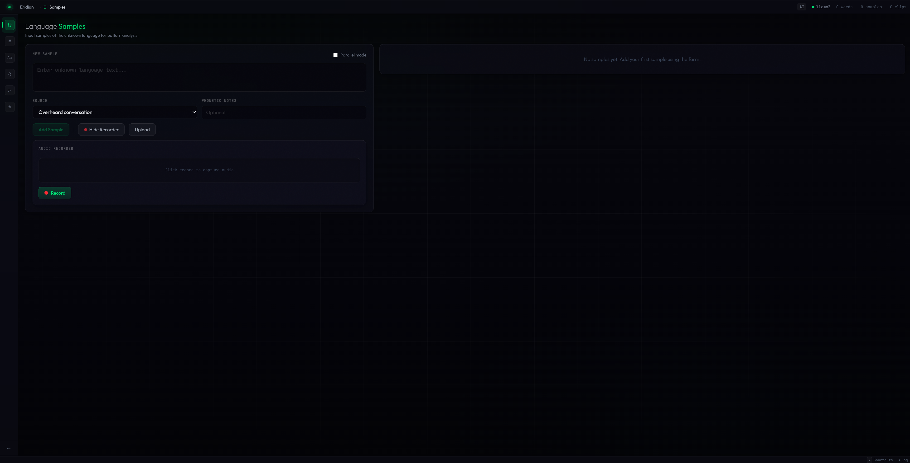
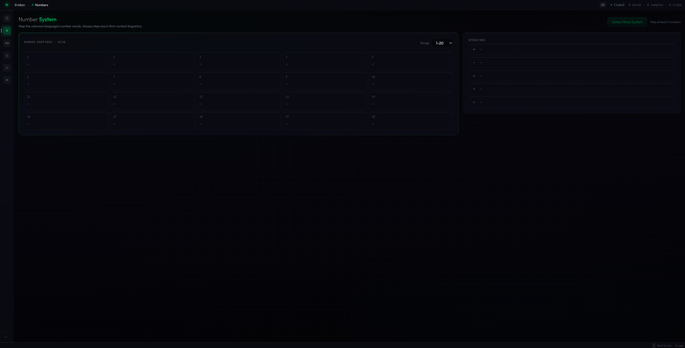
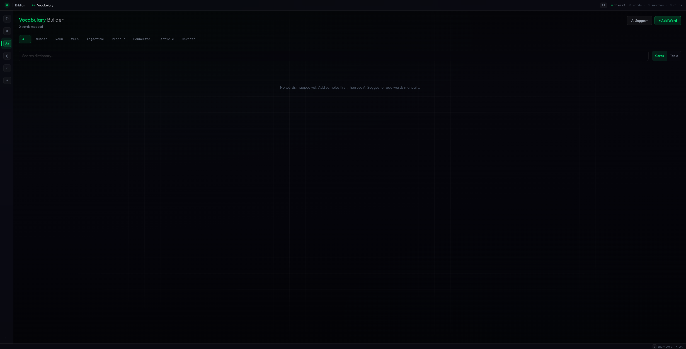
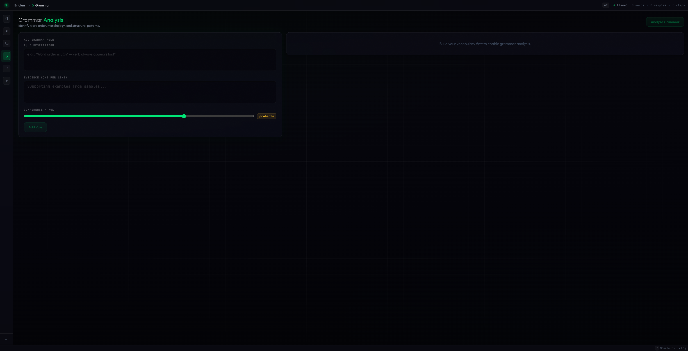
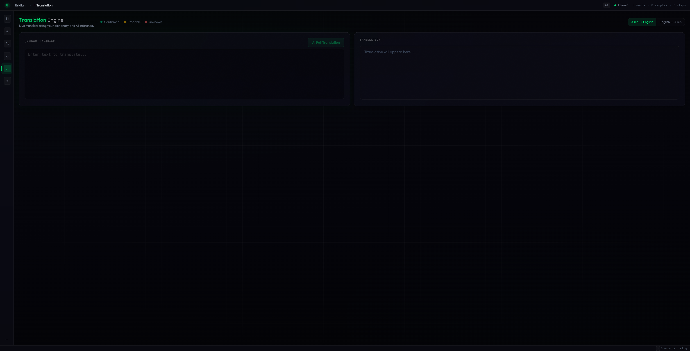
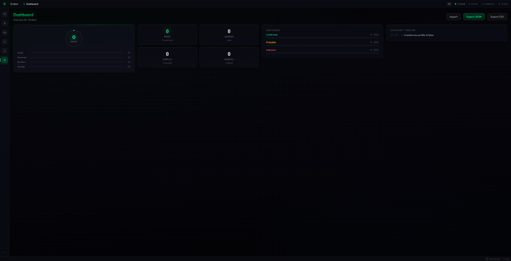

<p align="center">
  
</p>

<h1 align="center">Xenolinguist</h1>

<p align="center">
  <strong>AI-Powered Language Decoding Workbench</strong><br/>
  <em>Decode unknown languages from scratch — with AI as your research partner.</em>
</p>

<p align="center">
  
  
  
  
  
</p>

---

## Overview

Xenolinguist is a full-stack web application inspired by the first-contact language decoding scenes in *Project Hail Mary*. It provides a structured, six-phase workflow for systematically decoding an unknown language — whether it's a constructed language, an obscure real language, or a completely alien one.

The app simulates the experience of encountering a language with zero shared reference points and working through it methodically: starting with number systems, moving to vocabulary, then grammar, and eventually full translation — with a locally-hosted AI acting as your research partner throughout the entire process.

<p align="center">
  
  <br/><em>Landing screen with ambient particle field and frosted glass UI</em>
</p>

---

## Features

### Six-Phase Decoding Workflow

Each phase builds on the previous, guiding you through the linguistics methodology used in real first-contact scenarios.

| Phase | Name | Description |
|-------|------|-------------|
| 1 | **Samples** | Input and collect raw language samples with source tagging, audio recording, and parallel text mode |
| 2 | **Numbers** | Map the unknown number system — always the first step in first-contact linguistics |
| 3 | **Vocabulary** | Build a living dictionary with AI-assisted word suggestions, confidence tracking, and part-of-speech tagging |
| 4 | **Grammar** | Analyze word order, morphology, and structural patterns with confidence-scored rules |
| 5 | **Translation** | Live translation engine with word-by-word confidence highlighting and inline corrections |
| 6 | **Dashboard** | Track overall decoding progress with visual stats, import/export profiles, and discovery timeline |

<p align="center">
  
  <br/><em>Profile setup — Name and configure your language before decoding</em>
</p>

<p align="center">
  
  <br/><em>Phase 1 — Language sample collection with audio recording support</em>
</p>

<p align="center">
  
  <br/><em>Phase 2 — Number system decoder with operator mapping</em>
</p>

<p align="center">
  
  <br/><em>Phase 3 — Vocabulary builder with AI suggestions and category filtering</em>
</p>

<p align="center">
  
  <br/><em>Phase 4 — Grammar analysis with confidence-scored rule tracking</em>
</p>

<p align="center">
  
  <br/><em>Phase 5 — Live translation with confidence-coded word highlighting</em>
</p>

<p align="center">
  
  <br/><em>Phase 6 — Progress dashboard with animated stats and export options</em>
</p>

---

### AI Integration

Xenolinguist uses **Ollama** for fully local, private AI processing — your language data never leaves your machine.

- **Multi-model routing** — Automatically selects the optimal model per task (heavy models for deep analysis, light models for quick suggestions)
- **AI Chat Panel** — Streaming conversation panel with full context awareness of your dictionary, grammar rules, and samples
- **Auto-suggestions** — AI analyzes new samples in the background and suggests patterns as you work
- **Pattern analysis** — Deep grammar inference, vocabulary suggestions, number system detection, and full translation

### Sandbox Mode

Not ready to decode a real language? The **Sandbox** generates an AI-created constructed language with hidden rules, then guides you through decoding it step by step:

- Three difficulty levels (Easy, Medium, Hard)
- Four-step guided progression: Number Discovery, Word Mapping, Sentence Decoding, Grammar Revelation
- Three-tier hint system per challenge (category hint, context hint, full reveal)
- Accuracy tracking and completion stats

### Apple-Style Frosted Glass UI

The entire interface is built with a custom four-layer frosted glass design system inspired by Apple's latest OS aesthetics:

- **Depth-layered blur** — Four distinct glass levels (40px/24px/12px/48px) creating natural visual hierarchy
- **Light refraction borders** — Brighter top borders simulate real glass light behavior
- **Noise texture overlay** — Subtle fractal noise on all glass panels for material authenticity
- **Chrome text effects** — Metallic gradient text on headings with green accent highlights
- **Ambient particle field** — Interactive particles on the landing screen that react to mouse movement with connection lines between nearby particles

### Power User Features

- **Command Palette** (`Ctrl+K`) — Global search across your dictionary, samples, grammar rules, and number mappings
- **Keyboard Shortcuts** — Number keys 1-6 for phase navigation, `L` for session log, `Shift+A` for AI chat, `Ctrl+Z` for undo
- **Right-Click Context Menus** — Quick actions on samples and dictionary entries (copy, decode, delete)
- **Undo System** — Full undo support for deletions with data restoration
- **Toast Notifications** — Non-intrusive feedback with auto-dismiss and progress indicators
- **Onboarding Tour** — Nine-step guided walkthrough for first-time users
- **Session Log** — Complete activity history with timestamped entries
- **Audio Support** — Record and upload audio clips via Web Audio API and Web Speech API

---

## Tech Stack

| Layer | Technology |
|-------|-----------|
| **Frontend** | React 19, TypeScript 5.8, Vite 8 |
| **Styling** | Tailwind CSS v4 with `@tailwindcss/vite` plugin |
| **State** | React Context with custom hooks |
| **Backend** | Node.js, Express, TypeScript |
| **AI Engine** | Ollama (local LLM inference) |
| **Storage** | File-based JSON profiles (server-side) |
| **Audio** | Web Audio API, Web Speech API |
| **Monorepo** | npm workspaces (`client/`, `server/`, `shared/`) |

---

## Project Structure

```
Xenolinguist/
├── client/                    # React frontend
│   ├── src/
│   │   ├── components/
│   │   │   ├── landing/       # Landing screen, profile setup
│   │   │   ├── layout/        # AppShell, Sidebar, StatusBar, CommandPalette,
│   │   │   │                  # AIChat, ContextMenu, OnboardingTour, ToastContainer
│   │   │   ├── phase1-samples/
│   │   │   ├── phase2-numbers/
│   │   │   ├── phase3-vocabulary/
│   │   │   ├── phase4-grammar/
│   │   │   ├── phase5-translation/
│   │   │   ├── phase6-dashboard/
│   │   │   └── sandbox/       # AI-generated language challenge mode
│   │   ├── hooks/             # useAI, useAutoSuggest, useKeyboardShortcuts, useUndoRedo
│   │   ├── stores/            # React contexts (profile, ollama, session-log, toast, undo)
│   │   └── index.css          # Complete design system (glass, animations, chrome text)
│   └── public/
│       ├── favicon.svg
│       └── logo.svg
├── server/                    # Express backend
│   └── src/
│       ├── routes/            # API routes (profiles, ollama proxy)
│       └── services/          # Profile storage, AI service abstraction
├── shared/                    # Shared types, constants, prompt templates
│   ├── types.ts
│   ├── constants.ts
│   └── prompts.ts
├── package.json               # Workspace root
└── tsconfig.base.json         # Shared TypeScript config
```

---

## Getting Started

### Prerequisites

- **Node.js** 18+ and **npm** 9+
- **Ollama** installed and running locally ([ollama.com](https://ollama.com))
- At least one language model pulled (recommended: `llama3.1:8b` or `qwen3:32b`)

### Installation

```bash
# Clone the repository
git clone https://github.com/Parusann/Xenolinguist.git
cd Xenolinguist

# Install dependencies
npm install

# Pull a recommended Ollama model
ollama pull llama3.1:8b

# Start the development servers (client + server concurrently)
npm run dev
```

The app will be available at **http://localhost:5173** with the API server on **http://localhost:3001**.

### Environment Variables

Copy the example environment file and configure as needed:

```bash
cp .env.example .env
```

| Variable | Default | Description |
|----------|---------|-------------|
| `PORT` | `3001` | API server port |
| `OLLAMA_URL` | `http://localhost:11434` | Ollama API endpoint |

---

## Usage

### Creating a New Language Profile

1. Click **New Language** on the landing screen
2. Name your language and optionally add a description and phonetic notes
3. Click **Begin Decoding** to enter the six-phase workflow

### Decoding Workflow

1. **Collect Samples** — Paste, type, or record unknown language text. Tag each sample with its source.
2. **Map Numbers** — The number system is always decoded first. Map number words 1-20+ and detect the base system.
3. **Build Vocabulary** — Manually add words or let AI suggest mappings. Each word tracks confidence, part of speech, and context.
4. **Analyze Grammar** — Document word order rules, morphology patterns, and structural observations with evidence.
5. **Translate** — Enter text for live word-by-word translation. Click any word to inspect or correct it. Use AI for full-sentence translation.
6. **Review Progress** — Track your decoding percentage, export your profile, or import previous work.

### Sandbox Mode

1. Click **Sandbox** on the landing screen
2. Choose a difficulty level (Easy / Medium / Hard)
3. The AI generates a complete constructed language with hidden rules
4. Work through four guided steps to decode it, using hints when stuck

---

## Keyboard Shortcuts

| Shortcut | Action |
|----------|--------|
| `1` - `6` | Navigate to phases |
| `Ctrl+K` | Open command palette |
| `Shift+A` | Toggle AI chat panel |
| `L` | Toggle session log |
| `Ctrl+Z` | Undo last action |
| `Shift+?` | Show all shortcuts |
| `Esc` | Close open panel |

---

## API Endpoints

| Method | Endpoint | Description |
|--------|----------|-------------|
| `GET` | `/api/profiles` | List all saved profiles |
| `POST` | `/api/profiles` | Create a new profile |
| `GET` | `/api/profiles/:id` | Get a specific profile |
| `PUT` | `/api/profiles/:id` | Update a profile |
| `DELETE` | `/api/profiles/:id` | Delete a profile |
| `POST` | `/api/ai/generate` | Send a prompt to Ollama |
| `POST` | `/api/ai/stream` | Stream a response from Ollama |
| `GET` | `/api/ai/models` | List available Ollama models |

---

## Building for Production

```bash
# Build both client and server
npm run build

# Client output: client/dist/
# Server output: server/dist/
```

---

## License

Copyright (c) 2026 Parusan Natheeswaran. All Rights Reserved.

This software is proprietary. See [LICENSE](LICENSE) for details.
