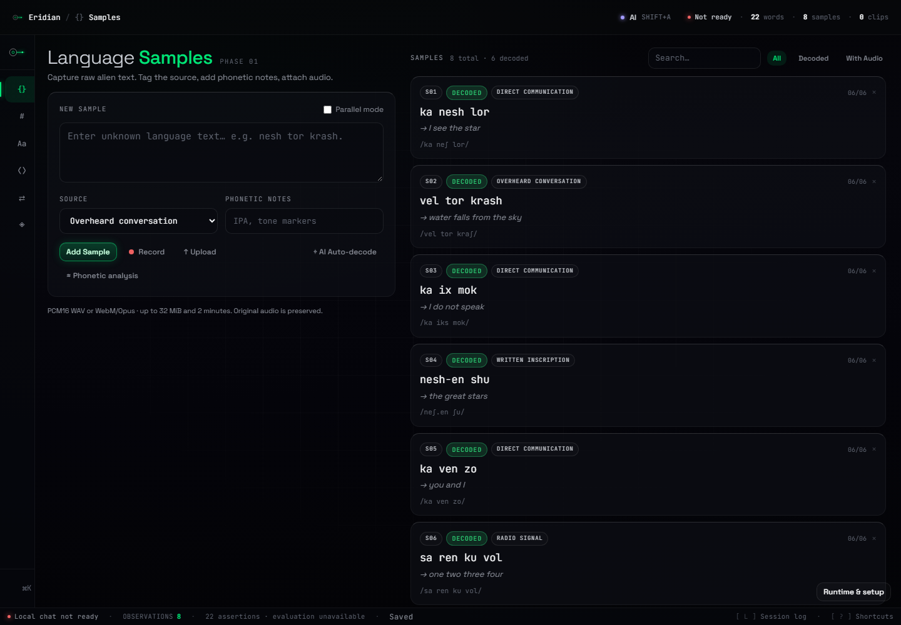
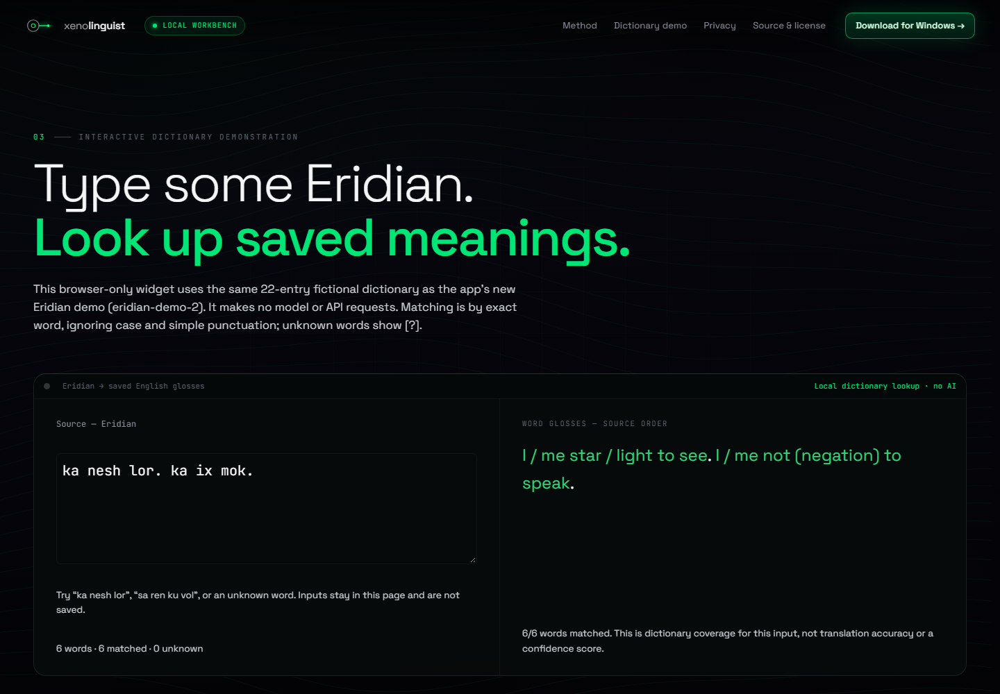

<p align="center"></p>

# Xenolinguist

A local desktop workbench for constructed-language exploration: collect text and recordings, build a dictionary, record grammar hypotheses and review local-model suggestions. The project combines typed data contracts, recoverable storage, native audio processing and controlled inference. It does not autonomously decipher arbitrary unknown languages.

## Download versus implementation preview

**Published installer:** [v1.0.0 for Windows x64](https://github.com/Parusann/Xenolinguist/releases/download/v1.0.0/Xenolinguist-Setup-1.0.0.exe), published June 14, 2026, 440,684,361 bytes, unsigned. [Release details](https://github.com/Parusann/Xenolinguist/releases/tag/v1.0.0).

**Current development:** [implementation/reliability](https://github.com/Parusann/Xenolinguist/tree/implementation/reliability). The implementation improvements described below are **not in that published installer**. The package version remains 1.0.0 during development; source revision and retained verification records identify the tested builds. No new installer has been released as part of these changes.

The old installer predates the repaired phone runtime, revision-checked saves, recovery, authenticated local API and controlled model setup. It can attempt an automatic Ollama model download. The pre-implementation packaged baseline failed phone analysis; that baseline is a separate artifact and does not certify the published installer. Windows may identify the unsigned installer as an unknown publisher. Review the [release boundary](docs/desktop-release.md) before installing.

[Public website](https://parusann.github.io/Xenolinguist/) is deployed from `main`; changes on the implementation branch appear there only after deployment. Its browser dictionary demonstration needs no backend or model.

## What the implementation does

| Phase | Behavior | Interpretation limit |
| --- | --- | --- |
| Samples | Retains text drafts, original audio, prepared analysis copies and saved clip/word links | Recordings are observations; transcriptions can be wrong |
| Numbers | Stores integer mappings and ranks candidate bases with explicit support and ties | Exploratory fit is not proof of a number system |
| Vocabulary | Stores display glosses, explicit senses, accepted aliases, examples and optional user belief | User belief is not calibrated confidence |
| Grammar | Stores notebook prose or typed affix, negation, adjective and clause rules with previews | Executable rules are manual assertions, not discovered facts |
| Translation | Separate lexical glosses, bounded symbolic meaning trees with derivations, and optional model output | Symbolic mode supports one typed clause or noun phrase; general syntax and script-specific segmentation remain unsupported |
| Dashboard | Shows content counts and server-recorded metric history | Counts are not decoding accuracy or evaluated coverage |

Creative practice generates a language with a selected local model, validates its structure, saves the session and grades against the generated answer key. The key can be linguistically inconsistent. Practice scores are separate from scientific evaluation, and assistance is accounted for separately.

Deterministic practice uses an executable, bounded language compiler with private server grading, explicit answer reveals and recoverable sessions. Its versioned corpus supplies 90 seed-disjoint languages for research. See [compiler behavior and limits](docs/deterministic-compiler.md).

The Eridian seed is a versioned fictional teaching corpus. The app, public dictionary widget and illustrative hero examples derive their meanings from the same source. Existing saved demo profiles are not overwritten by a seed update.



*W11 browser workbench: the shared fictional demo with manual work available and chat not ready. This is the implementation preview, not the published installer.*

## Engineering behind the interface

- **Typed grammar:** bounded morphology and span-chart parsing, explicit argument frames, traceable semantic roles and reverse generation. Every derivation cites rules and original spans; incomplete searches remain unresolved. See [typed grammar](docs/typed-grammar.md).
- **Lexical processing:** NFC comparison, original Unicode source spans, profile-controlled case/boundaries, cached lookup tries and explicit sense/alias contracts. Ambiguous lexical matches remain visible. See [Unicode lexicon](docs/unicode-lexicon.md).
- **Persistence:** shared Zod schemas, guarded legacy migration, revision conflicts, serialized typed mutations, idempotency receipts, atomic replacement and recovery snapshots. A durable client queue retains pending work through restart.
- **Audio:** immutable staged originals with SHA256 identities, a worker-prepared analysis copy, explicit inference/retry and atomic sample/clip saves. Windows packaging checks manifested native assets and isolated runtime dependencies.
- **Inference:** local-model eligibility checks, explicit downloads, task-specific context/output budgets, deadlines, bounded queues and NDJSON validation. Cancellation propagates to Ollama, whisper and a disposable phone process; capacity is released after cleanup.
- **Security boundary:** a per-launch desktop credential delivered through IPC, trusted-main-frame API access, Host/Origin checks, sandboxed rendering, restricted navigation and permissions. See [local security](docs/local-security.md).
- **Retained proposals:** profile-scoped chat and task output, including partial text, model name, task and errors. Retention is bounded; proposals remain advisory.

Architecture and behavior: [feature reference](docs/FEATURES.md), [audio lifecycle](docs/audio-lifecycle.md), [runtime jobs](docs/runtime-jobs.md), [workspace evidence](docs/workspace-evidence.md), [sandbox sessions](docs/sandbox-sessions.md).

## Reproducible language-learning experiments

The offline evaluation harness compares frozen word lookup, a constrained symbolic learner, local-model inference and a hybrid fallback. Each receives the same observations; the scorer keeps target meanings separate. The symbolic method eliminates inconsistent structural hypotheses and learns lexical bindings from examples. Its supplied grammar assumptions are explicit, so success is not presented as unrestricted language discovery.

`npm run evaluate:full` produces per-item predictions, model digests/settings, source and corpus hashes, paired language-level uncertainty intervals and standalone figures. The initial configuration uses 30 evaluation languages, three observation budgets and two model sampling seeds. [The measured results and downloadable raw archives](docs/evaluation-results.md) retain successful, invalid and incomplete predictions. `npm run evaluate:verify -- RESULT_DIRECTORY` replays scoring and checks retained artifacts without model inference. Setup, method definitions and interpretation limits are in the [evaluation protocol](docs/evaluation-protocol.md). This research harness is separate from the workbench's dictionary translator.

## Setup and offline operation

Windows x64 is the only manifested native target. An independent Windows CI job installs and verifies implementation artifacts on a fresh runner; public release and signing remain pending. macOS/Linux packaging is not supported by the current native manifest.

Manual text, dictionary and grammar work do not require Ollama. For model assistance, install/start [Ollama](https://ollama.com), then use **Runtime & setup** to select an installed, verified local completion model. Downloads require an explicit click in the preview. The default `gemma4:e4b` is about 9.61 GB; optional `llama3.2:3b` is about 2.02 GB. Allow additional temporary disk space. Model speed and memory requirements depend on hardware; no broad quality ranking is established.

Native audio uses bundled eSpeak NG, whisper.cpp and a wav2vec2 CTC model. The phone endpoint accepts mono PCM16 RIFF/WAVE at 16 kHz, 25 ms–120 seconds, and emits approximate **TIMIT ARPABET** from an English-trained model. It is not strict IPA or a universal/click-consonant recognizer. Browser-decodable WAV/WebM recordings are prepared for analysis; codec support varies. See [phone model notes](docs/ipa-model-notes.md) and [third-party provenance](vendor/THIRD_PARTY.md).

Local work can run offline once assets and any selected model are installed. Installation, downloads, external links and desktop update checks use the network. Browser/OS speech fallback depends on the selected voice. Local-model checks rely on accurate Ollama metadata. This is not an absolute guarantee against all network activity on the host.

## Build and verify

Use Node 24 and `npm ci` to match CI. Local W12 checks also passed on Node 25.8.2; the tested Electron 42.11.3 artifact embeds Node 24.19.0. See the lockfile and [CI/release guide](docs/ci-release-gates.md).

```sh
git clone --branch implementation/reliability https://github.com/Parusann/Xenolinguist.git
cd Xenolinguist
npm ci
npm run provision:models
# If the ignored native model is absent, explicitly download its pinned distribution:
npm run provision:models -- --download
npm run build:desktop
npm run dev
```

Direct development browser use requires the one-time local pairing code printed by the backend. Open the Vite URL, choose the workbench and enter that code. `npm run electron:dev` starts the desktop development flow. Voice paths must be configured for direct development; the packaged app resolves its bundled resources. Model downloads are optional and separate from native asset provisioning.

```sh
npm run check:source
npx playwright install chromium
npm run test:e2e:run
npm run test:public
npm run audit:record
# Build the Windows artifact locally; this command does not publish a release:
npm run dist
```

Source CI requires unit/tooling tests, workbench and public-site checks, and a deterministic evaluation subset. A separate installed-application CI workflow requires native audio, access boundaries, archive round trips and restart recovery on a fresh Windows runner. Three gated native unit skips remain explicit; the former expected Unicode workbench failure now passes. Real local-model experiments require an available host with installed models. Current counts and verification records are in [implementation progress](docs/implementation-progress.md); commands are in [testing](docs/testing.md), and unresolved advisories are in the [dependency review](docs/dependency-review.md). Application checks do not establish linguistic quality or certify the old installer.

Configuration includes `DATA_DIR`, `PORT`, `OLLAMA_BASE_URL` (loopback HTTP only), `OLLAMA_MODEL`, `WHISPER_TIMEOUT_MS`, `TTS_TIMEOUT_MS` and the native asset paths. Context/output budgets and generation deadlines are server-owned; the former `OLLAMA_TIMEOUT_MS` setting does not control the current generation service.



*W11 public-page preview: exact lookup using the app’s Eridian seed, with no model requests. [Screenshot provenance](docs/screenshots/README.md).*

## Export and remaining work

The Field Log exports portable **.xeno project archives**, including saved data, AI/metric history and recording bytes. Sandbox answers and progress are an explicit option. Import from the profile selector or Field Log; preview verified content, create a new project by default, or explicitly replace a project after an automatic complete backup. See [archive format, limits and recovery](docs/project-archives.md).

Profile JSON contains metadata and audio references, **not recording bytes**. Dashboard JSON import replaces selected data fields in the active profile; it does not restore chat, sandbox sessions, metric history or missing audio files. Dictionary CSV is a limited interchange format. Neither is a full project backup.

The deterministic compiler, reproducible evaluation harness, Unicode lexicon and typed interpreter now support grounded affix/order induction. Number grammar inference, first-class evidence relationships and validated model research proposals remain roadmap work. Read the [limitations](docs/limitations.md) and [implementation progress](docs/implementation-progress.md).

## License

Copyright (c) 2026 Parusan Natheeswaran. All Rights Reserved. The repository is publicly viewable, but the project is proprietary and the [LICENSE](LICENSE) grants no general reuse rights. Third-party dependencies and native assets retain their own [licenses and notices](vendor/THIRD_PARTY.md).


The [grounded induction engine](docs/grounded-induction.md) learns bounded affix and word-order proposals from supplied lexical anchors and distinct grounded observations. Fit-only description-length search, independent validation, manual acceptance and retained ablations make its assumptions inspectable. It does not discover arbitrary languages or silently use model output as ground truth.
