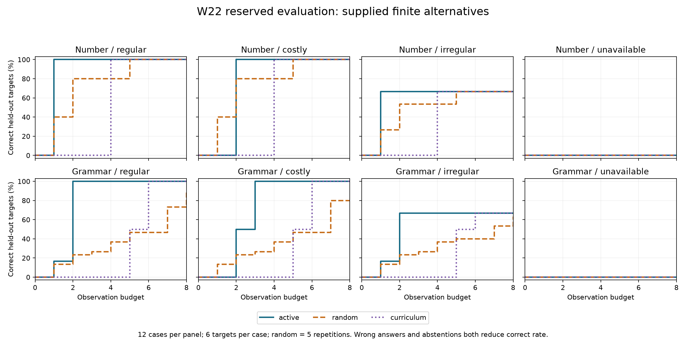
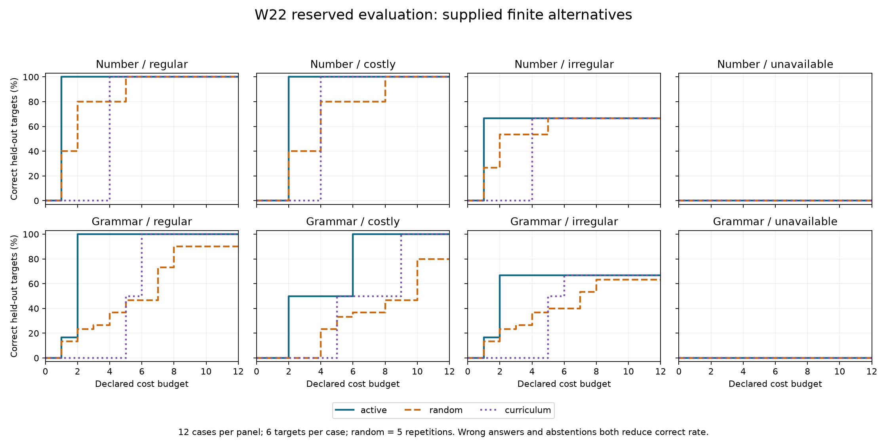

# W22 active elicitation results

Active selection reaches full held-out accuracy sooner on these regular synthetic cases: one answer for numbers and two for grammar. This is evidence about selecting questions among supplied finite alternatives. It does not establish discovery of new language rules or natural-language performance. Cost weighting loses to random selection after the first costly-condition answer, unseen irregular forms produce wrong regularizations, and incomplete alternatives leave every policy abstaining.

## Frozen experiment

Both runs use revision `af1a197cca74726132ec529e15df8bc274b6c260` and the [predeclared protocol](elicitation-evaluation-protocol.md). Development retains 48 cases / 336 traces; reserved evaluation retains 96 cases / 672 traces. Each case supplies six withheld targets and runs active, five seeded-random repetitions and a fixed curriculum. Both complete with zero failed traces and pass deterministic replay after archive extraction. No corpus, policy or scoring change occurred between the runs.

The supplied number alternatives differ in additive/multiplicative realization and ordering; grammar alternatives differ in plural/past affix position and clause order. Oracle renderers are independent of the shipping generator. The selector receives only visible alternatives, questions and previously requested answers. These are synthetic priors, not alternatives learned by the experiment. Costs are declared units, not measured human effort or elapsed time.

All normalized curve points, mean queries, mean cost and mean remaining alternatives are identical between development and evaluation. Seed-specific vocabulary changes, but the same small structural templates and five random seeds are reused. Cases therefore are not independent samples of language diversity; the larger reserved count should not be read as stronger statistical evidence. No confidence intervals, significance or calibrated uncertainty are claimed.

## What the comparison shows

- Regular numbers reach 72/72 correct after one active answer, versus 144/360 (40%) for random and 0/72 for curriculum. At the final budget, all reach full accuracy, consuming mean 1.0, 2.2 and 4.0 questions respectively.
- Regular grammar reaches 72/72 after two active answers, versus 84/360 (23.3%) for random and 0/72 for curriculum. At eight observations, random retains 36 abstentions and scores 324/360 (90%); curriculum reaches full accuracy after six answers.
- Costly numbers score 0/72 after one active answer, while random scores 144/360 (40%). At cost two, active reaches 72/72 while random scores 144/360. The active policy chooses two cheap distinctions rather than one expensive complete distinction. This is a real tradeoff between cost and observation count.
- Costly grammar also loses to random after one observation: 0% versus 13.3%. It reaches full accuracy in three answers costing six; curriculum needs six answers costing nine. Random ends at 80% with mean cost ten.
- Withheld irregular conditions make active selection unanimous but wrong on 24/72 targets in each domain. Faster identification of the supplied regular alternative does not reveal invisible exceptions. All methods' errors remain in the report.
- With an incomplete alternative, active selection asks no eligible question and abstains on all 72 targets per domain. Baselines ask eight questions and still abstain on all 360/72 targets. This exposes the conservative selector's inability to resolve missing predictions; it is not successful learning.

Observation and cost curves below count both errors and abstentions against correct rate. Each point uses the last completed prefix within its budget and carries that state forward after stopping. A cost prefix is not a policy rerun with a smaller total budget. Full tables follow the interpretation and raw-evidence section.





Vector figures: [observations](verification/w22-elicitation-observations.svg), [cost](verification/w22-elicitation-cost.svg).

For a concrete trace, reserved number seed 9200 uses base five. With unit costs, active selection asks for 11 and reduces six alternatives to one. When that question costs four, it asks for 10 and then 6, reducing six alternatives to two to one at total cost two. Reserved grammar seed 9200 asks for a past-tense clause and then a plural-subject clause with unit costs, reducing eight alternatives to two to one. Under the costly condition it instead asks a future clause, a plural noun and the past clause, reducing eight to four to two to one at costs one, two and six. These exact traces are in the evaluation archive as `number-9200-regular-active-0.json`, `number-9200-costly-active-0.json`, `grammar-9200-regular-active-0.json` and `grammar-9200-costly-active-0.json`.

## Interpretation and follow-up

The comparison supports the bounded claim that explicit candidate disagreement can select informative questions sooner than these random and fixed-order controls. The fixed curriculum deliberately includes atomic and repeated-feature questions; it is not an expert-designed optimum. Five random repetitions provide a reproducible control, not a broad Monte Carlo estimate. The casewise deltas below average those repetitions before comparison.

The negative conditions suggest three future experiments: test a fallback policy that collects evidence despite missing candidate predictions; compare greedy information-per-cost against a finite-budget planner; and evaluate alternative generation plus query selection jointly, using newly reserved structural families and irregular evidence. Each changes the research question and needs a new frozen protocol. No such refinement is claimed here. These synthetic results should accompany, rather than replace, the recorded workbench answer/restart/archive examples in [active elicitation](active-elicitation.md).

## Raw evidence and replay

Download [development](verification/w22-elicitation-development.zip) and [reserved evaluation](verification/w22-elicitation-evaluation.zip). Each includes the exact source/lockfile snapshot, manifest, independent oracle corpus, all selector inputs/plans, selected answers, remaining alternatives, per-step held-out predictions and complete summaries. Both partitions share source snapshot hash `cfd8e802f18e58028e99c77d7c188c87af58c586a6b162b36a607122cd2ff896`.

| Archive | Bytes | SHA-256 |
| --- | ---: | --- |
| Development | 2,467,533 | `f1e54bce3cfc951ea527d205063c6d7d1160b644ee0c055659c2e9fa7069a2bf` |
| Evaluation | 4,643,632 | `d0b6ecce0baaa89e4b1cbf49762bdeaba1d704da935f3825148e6a55ce231856` |

Extract an archive to a new directory, enter its `source` subdirectory, and run:

```sh
npm ci
npx tsx evaluation/src/elicitation/run.ts verify ..
```

Replay checks the complete scheduled set, source inventory, archived byte hashes, oracle corpus, every deterministic choice/answer/prediction and the summaries. Both extracted archives pass using their own source; evaluation additionally passes after `npm ci` in that source snapshot. Failures are not discarded. This is deterministic recomputation, not reproduction of original runtime timing. The retained corpus contains answers for audit; they remain outside the selector's input.

## Final-budget errors, abstentions and effort

The following states are at eight observations or earlier stopping, within total cost 12. Denominators are 72 for active/curriculum and 360 for random in every domain/condition. A correct rate alone cannot distinguish wrong predictions from abstention.
| Domain / condition | Policy | Correct / wrong / abstained | Mean queries | Mean cost |
| --- | --- | --- | ---: | ---: |
| number / regular | active | 72 / 0 / 0 | 1.0 | 1.0 |
| number / regular | random | 360 / 0 / 0 | 2.2 | 2.2 |
| number / regular | curriculum | 72 / 0 / 0 | 4.0 | 4.0 |
| number / costly | active | 72 / 0 / 0 | 2.0 | 2.0 |
| number / costly | random | 360 / 0 / 0 | 2.2 | 4.0 |
| number / costly | curriculum | 72 / 0 / 0 | 4.0 | 4.0 |
| number / withheld-irregular | active | 48 / 24 / 0 | 1.0 | 1.0 |
| number / withheld-irregular | random | 240 / 120 / 0 | 2.2 | 2.2 |
| number / withheld-irregular | curriculum | 48 / 24 / 0 | 4.0 | 4.0 |
| number / unavailable | active | 0 / 0 / 72 | 0.0 | 0.0 |
| number / unavailable | random | 0 / 0 / 360 | 8.0 | 8.0 |
| number / unavailable | curriculum | 0 / 0 / 72 | 8.0 | 8.0 |
| grammar / regular | active | 72 / 0 / 0 | 2.0 | 2.0 |
| grammar / regular | random | 324 / 0 / 36 | 7.0 | 7.0 |
| grammar / regular | curriculum | 72 / 0 / 0 | 6.0 | 6.0 |
| grammar / costly | active | 72 / 0 / 0 | 3.0 | 6.0 |
| grammar / costly | random | 288 / 0 / 72 | 7.0 | 10.0 |
| grammar / costly | curriculum | 72 / 0 / 0 | 6.0 | 9.0 |
| grammar / withheld-irregular | active | 48 / 24 / 0 | 2.0 | 2.0 |
| grammar / withheld-irregular | random | 228 / 96 / 36 | 7.0 | 7.0 |
| grammar / withheld-irregular | curriculum | 48 / 24 / 0 | 6.0 | 6.0 |
| grammar / unavailable | active | 0 / 0 / 72 | 0.0 | 0.0 |
| grammar / unavailable | random | 0 / 0 / 360 | 8.0 | 8.0 |
| grammar / unavailable | curriculum | 0 / 0 / 72 | 8.0 | 8.0 |

## Accuracy by observations

| Domain / condition | Budget | Active | Random (5 repetitions) | Fixed curriculum |
| --- | ---: | ---: | ---: | ---: |
| number / regular | 1 | 72/72 (100.0%) | 144/360 (40.0%) | 0/72 (0.0%) |
| number / regular | 2 | 72/72 (100.0%) | 288/360 (80.0%) | 0/72 (0.0%) |
| number / regular | 4 | 72/72 (100.0%) | 288/360 (80.0%) | 72/72 (100.0%) |
| number / regular | 8 | 72/72 (100.0%) | 360/360 (100.0%) | 72/72 (100.0%) |
| number / costly | 1 | 0/72 (0.0%) | 144/360 (40.0%) | 0/72 (0.0%) |
| number / costly | 2 | 72/72 (100.0%) | 288/360 (80.0%) | 0/72 (0.0%) |
| number / costly | 4 | 72/72 (100.0%) | 288/360 (80.0%) | 72/72 (100.0%) |
| number / costly | 8 | 72/72 (100.0%) | 360/360 (100.0%) | 72/72 (100.0%) |
| number / withheld-irregular | 1 | 48/72 (66.7%) | 96/360 (26.7%) | 0/72 (0.0%) |
| number / withheld-irregular | 2 | 48/72 (66.7%) | 192/360 (53.3%) | 0/72 (0.0%) |
| number / withheld-irregular | 4 | 48/72 (66.7%) | 192/360 (53.3%) | 48/72 (66.7%) |
| number / withheld-irregular | 8 | 48/72 (66.7%) | 240/360 (66.7%) | 48/72 (66.7%) |
| number / unavailable | 1 | 0/72 (0.0%) | 0/360 (0.0%) | 0/72 (0.0%) |
| number / unavailable | 2 | 0/72 (0.0%) | 0/360 (0.0%) | 0/72 (0.0%) |
| number / unavailable | 4 | 0/72 (0.0%) | 0/360 (0.0%) | 0/72 (0.0%) |
| number / unavailable | 8 | 0/72 (0.0%) | 0/360 (0.0%) | 0/72 (0.0%) |
| grammar / regular | 1 | 12/72 (16.7%) | 48/360 (13.3%) | 0/72 (0.0%) |
| grammar / regular | 2 | 72/72 (100.0%) | 84/360 (23.3%) | 0/72 (0.0%) |
| grammar / regular | 4 | 72/72 (100.0%) | 132/360 (36.7%) | 0/72 (0.0%) |
| grammar / regular | 8 | 72/72 (100.0%) | 324/360 (90.0%) | 72/72 (100.0%) |
| grammar / costly | 1 | 0/72 (0.0%) | 48/360 (13.3%) | 0/72 (0.0%) |
| grammar / costly | 2 | 36/72 (50.0%) | 84/360 (23.3%) | 0/72 (0.0%) |
| grammar / costly | 4 | 72/72 (100.0%) | 132/360 (36.7%) | 0/72 (0.0%) |
| grammar / costly | 8 | 72/72 (100.0%) | 288/360 (80.0%) | 72/72 (100.0%) |
| grammar / withheld-irregular | 1 | 12/72 (16.7%) | 48/360 (13.3%) | 0/72 (0.0%) |
| grammar / withheld-irregular | 2 | 48/72 (66.7%) | 84/360 (23.3%) | 0/72 (0.0%) |
| grammar / withheld-irregular | 4 | 48/72 (66.7%) | 132/360 (36.7%) | 0/72 (0.0%) |
| grammar / withheld-irregular | 8 | 48/72 (66.7%) | 228/360 (63.3%) | 48/72 (66.7%) |
| grammar / unavailable | 1 | 0/72 (0.0%) | 0/360 (0.0%) | 0/72 (0.0%) |
| grammar / unavailable | 2 | 0/72 (0.0%) | 0/360 (0.0%) | 0/72 (0.0%) |
| grammar / unavailable | 4 | 0/72 (0.0%) | 0/360 (0.0%) | 0/72 (0.0%) |
| grammar / unavailable | 8 | 0/72 (0.0%) | 0/360 (0.0%) | 0/72 (0.0%) |

## Accuracy by declared cost

| Domain / condition | Budget | Active | Random (5 repetitions) | Fixed curriculum |
| --- | ---: | ---: | ---: | ---: |
| number / regular | 2 | 72/72 (100.0%) | 288/360 (80.0%) | 0/72 (0.0%) |
| number / regular | 4 | 72/72 (100.0%) | 288/360 (80.0%) | 72/72 (100.0%) |
| number / regular | 8 | 72/72 (100.0%) | 360/360 (100.0%) | 72/72 (100.0%) |
| number / regular | 12 | 72/72 (100.0%) | 360/360 (100.0%) | 72/72 (100.0%) |
| number / costly | 2 | 72/72 (100.0%) | 144/360 (40.0%) | 0/72 (0.0%) |
| number / costly | 4 | 72/72 (100.0%) | 288/360 (80.0%) | 72/72 (100.0%) |
| number / costly | 8 | 72/72 (100.0%) | 360/360 (100.0%) | 72/72 (100.0%) |
| number / costly | 12 | 72/72 (100.0%) | 360/360 (100.0%) | 72/72 (100.0%) |
| number / withheld-irregular | 2 | 48/72 (66.7%) | 192/360 (53.3%) | 0/72 (0.0%) |
| number / withheld-irregular | 4 | 48/72 (66.7%) | 192/360 (53.3%) | 48/72 (66.7%) |
| number / withheld-irregular | 8 | 48/72 (66.7%) | 240/360 (66.7%) | 48/72 (66.7%) |
| number / withheld-irregular | 12 | 48/72 (66.7%) | 240/360 (66.7%) | 48/72 (66.7%) |
| number / unavailable | 2 | 0/72 (0.0%) | 0/360 (0.0%) | 0/72 (0.0%) |
| number / unavailable | 4 | 0/72 (0.0%) | 0/360 (0.0%) | 0/72 (0.0%) |
| number / unavailable | 8 | 0/72 (0.0%) | 0/360 (0.0%) | 0/72 (0.0%) |
| number / unavailable | 12 | 0/72 (0.0%) | 0/360 (0.0%) | 0/72 (0.0%) |
| grammar / regular | 2 | 72/72 (100.0%) | 84/360 (23.3%) | 0/72 (0.0%) |
| grammar / regular | 4 | 72/72 (100.0%) | 132/360 (36.7%) | 0/72 (0.0%) |
| grammar / regular | 8 | 72/72 (100.0%) | 324/360 (90.0%) | 72/72 (100.0%) |
| grammar / regular | 12 | 72/72 (100.0%) | 324/360 (90.0%) | 72/72 (100.0%) |
| grammar / costly | 2 | 36/72 (50.0%) | 0/360 (0.0%) | 0/72 (0.0%) |
| grammar / costly | 4 | 36/72 (50.0%) | 84/360 (23.3%) | 0/72 (0.0%) |
| grammar / costly | 8 | 72/72 (100.0%) | 168/360 (46.7%) | 36/72 (50.0%) |
| grammar / costly | 12 | 72/72 (100.0%) | 288/360 (80.0%) | 72/72 (100.0%) |
| grammar / withheld-irregular | 2 | 48/72 (66.7%) | 84/360 (23.3%) | 0/72 (0.0%) |
| grammar / withheld-irregular | 4 | 48/72 (66.7%) | 132/360 (36.7%) | 0/72 (0.0%) |
| grammar / withheld-irregular | 8 | 48/72 (66.7%) | 228/360 (63.3%) | 48/72 (66.7%) |
| grammar / withheld-irregular | 12 | 48/72 (66.7%) | 228/360 (63.3%) | 48/72 (66.7%) |
| grammar / unavailable | 2 | 0/72 (0.0%) | 0/360 (0.0%) | 0/72 (0.0%) |
| grammar / unavailable | 4 | 0/72 (0.0%) | 0/360 (0.0%) | 0/72 (0.0%) |
| grammar / unavailable | 8 | 0/72 (0.0%) | 0/360 (0.0%) | 0/72 (0.0%) |
| grammar / unavailable | 12 | 0/72 (0.0%) | 0/360 (0.0%) | 0/72 (0.0%) |

## Paired case differences

| Domain / condition | At | Active − random | Wins / ties / losses | Active − curriculum | Wins / ties / losses |
| --- | --- | ---: | --- | ---: | --- |
| number / regular | 1 observations | +60.0 pp | 12 / 0 / 0 | +100.0 pp | 12 / 0 / 0 |
| grammar / regular | 2 observations | +76.7 pp | 12 / 0 / 0 | +100.0 pp | 12 / 0 / 0 |
| number / costly | 1 observations | -40.0 pp | 0 / 0 / 12 | +0.0 pp | 0 / 12 / 0 |
| grammar / costly | 1 observations | -13.3 pp | 0 / 0 / 12 | +0.0 pp | 0 / 12 / 0 |
| number / costly | 2 cost | +60.0 pp | 12 / 0 / 0 | +100.0 pp | 12 / 0 / 0 |
| grammar / costly | 2 cost | +50.0 pp | 12 / 0 / 0 | +50.0 pp | 12 / 0 / 0 |
| number / withheld-irregular | 8 observations | +0.0 pp | 0 / 12 / 0 | +0.0 pp | 0 / 12 / 0 |
| grammar / withheld-irregular | 8 observations | +3.3 pp | 12 / 0 / 0 | +0.0 pp | 0 / 12 / 0 |
| number / unavailable | 8 observations | +0.0 pp | 0 / 12 / 0 | +0.0 pp | 0 / 12 / 0 |
| grammar / unavailable | 8 observations | +0.0 pp | 0 / 12 / 0 | +0.0 pp | 0 / 12 / 0 |

## Engineering verification

[Windows/Linux source CI](https://github.com/Parusann/Xenolinguist/actions/runs/36959426454) at the frozen revision passes 450 unit tests, seven tooling tests, lint, type checks, desktop build, 46 workbench checks and eight public checks per platform. The separate 56-trace CI corpus and the earlier 12/60/336 experiment records replay from both platforms' artifacts. Browser reports contain no skipped, flaky or unexpected results. Three native unit checks remain gated.

[Independent installed Windows acceptance](https://github.com/Parusann/Xenolinguist/actions/runs/36959426438) verifies 3,774 application files and its existing native/restart/research/eight-archive flows. This benchmark is covered by source tests and experiment replay. [Machine-readable verification](verification/w22-elicitation-evaluation.json) records exact source/payload identities, archive hashes, final outcomes and scope. Dependency findings remain four high in production and five high plus one moderate overall; see [dependency review](dependency-review.md). No main merge, installer release or Pages deployment occurred.
