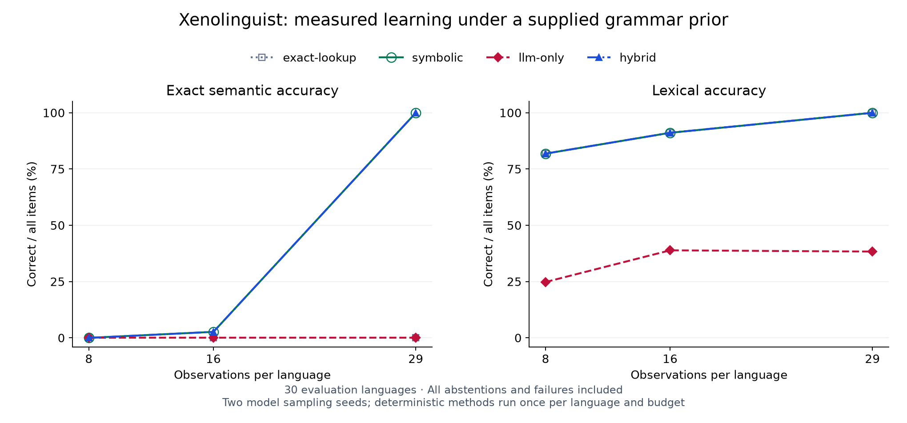

# W15 baseline results

The constrained symbolic learner scored **150/150** on the frozen evaluation challenges after 29 observations per language. Its hypothesis class is supplied: this measures parameter and vocabulary induction within a known grammar, not unrestricted language discovery. The local-model-only configuration scored **0/300**; the hybrid scored **300/300**, making **0 model calls** at that budget. Full-budget hybrid success therefore comes from the symbolic solver.

Implementation [`fbf8365`](https://github.com/Parusann/Xenolinguist/commit/fbf836513014f99eb09ea061d9a3e64974c7860a) was committed before evaluation began. No adapters, prompts, corpus, settings or predictions were changed after inspecting these evaluation results. The [protocol](evaluation-protocol.md) defines the common grammar prior, information budget, method ablations, scoring and limitations.

## Initial comparison

Thirty SVO/SOV evaluation languages, five withheld compositions and nine lexical probes each; observation prefixes of 8, 16 and 29; two sampling seeds for local-model/hybrid methods. Deterministic methods run once per language/budget. The 540 batch records contain 7,560 scored items, including repeated model trials; these are **30 independent language units**, not 7,560 independent samples. There were 300 actual local generation calls.

The local model was `gemma4:e4b` (digest `c6eb396dbd5992bbe3f5cdb947e8bbc0ee413d7c17e2beaae69f5d569cf982eb`) on Ollama 0.32.5. Temperature was 0.2, thinking was disabled, and seeds 41/42 used an 8,192-token context and 2,048-token output cap. The exact machine/runtime and model residency are retained in the archive.

| Method | Observations | Semantic correct / all | Coverage | Lexical accuracy | Model calls | Median batch ms |
| --- | ---: | ---: | ---: | ---: | ---: | ---: |
| exact-lookup | 8 | 0/150 (0.0%) | 0.0% | 81.9% | 0 | 0.42 |
| symbolic | 8 | 0/150 (0.0%) | 0.0% | 81.9% | 0 | 0.28 |
| llm-only | 8 | 0/300 (0.0%) | 30.0% | 24.8% | 60 | 4625.14 |
| hybrid | 8 | 0/300 (0.0%) | 13.0% | 81.9% | 60 | 3974.18 |
| exact-lookup | 16 | 0/150 (0.0%) | 0.0% | 91.1% | 0 | 0.58 |
| symbolic | 16 | 4/150 (2.7%) | 2.7% | 91.1% | 0 | 0.32 |
| llm-only | 16 | 0/300 (0.0%) | 37.3% | 38.9% | 60 | 4635.49 |
| hybrid | 16 | 8/300 (2.7%) | 7.7% | 91.1% | 60 | 1550.47 |
| exact-lookup | 29 | 0/150 (0.0%) | 0.0% | 100.0% | 0 | 0.59 |
| symbolic | 29 | 150/150 (100.0%) | 100.0% | 100.0% | 0 | 0.61 |
| llm-only | 29 | 0/300 (0.0%) | 15.0% | 38.3% | 60 | 5474.21 |
| hybrid | 29 | 300/300 (100.0%) | 100.0% | 100.0% | 0 | 0.59 |

Exact lookup receives the same inferred dictionary but cannot compose semantic trees, so it abstains on semantic queries. Its lexical score and retained glosses are the appropriate dictionary-level results. Treating its zero semantic score as a general translation-quality ranking would be misleading.

At 29 observations, the paired hybrid-minus-model semantic accuracy difference is 100.0% (95% language-cluster bootstrap interval 100.0% to 100.0%). Repetitions are averaged within language before resampling. These intervals condition on the synthetic corpus; identical outcomes can produce degenerate intervals and do not establish zero uncertainty outside it. All contrasts and withheld-count scores are in the retained numerical summary.

The overview connects the three tested observation budgets. Some series coincide. The [publication plotting script](verification/plot-w15-results.py) reads the unchanged raw results; original coverage, latency and ablation figures remain in the experiment archive. Latency includes induction, metadata checks and inference per batch, uses this machine's caches, and is not a hardware-independent speed claim.

## Failed answers remain visible

| Method | Observations | Answered | Abstained | Invalid | Error | Timeout |
| --- | ---: | ---: | ---: | ---: | ---: | ---: |
| exact-lookup | 8 | 0 | 150 | 0 | 0 | 0 |
| symbolic | 8 | 0 | 150 | 0 | 0 | 0 |
| llm-only | 8 | 90 | 0 | 165 | 45 | 0 |
| hybrid | 8 | 39 | 90 | 161 | 10 | 0 |
| exact-lookup | 16 | 0 | 150 | 0 | 0 | 0 |
| symbolic | 16 | 4 | 146 | 0 | 0 | 0 |
| llm-only | 16 | 112 | 5 | 183 | 0 | 0 |
| hybrid | 16 | 23 | 192 | 80 | 5 | 0 |
| exact-lookup | 29 | 0 | 150 | 0 | 0 | 0 |
| symbolic | 29 | 150 | 0 | 0 | 0 | 0 |
| llm-only | 29 | 45 | 0 | 220 | 35 | 0 |
| hybrid | 29 | 300 | 0 | 0 | 0 | 0 |

These are semantic-item counts. Schema-valid answers can still be incorrect; see accuracy above. Invalid JSON/trees, missing or duplicate IDs, abstentions and transport failures remain in the denominator. Two model sampling seeds were retained without selecting a best run. Raw responses, lexical outcomes and repeated-output agreement are in the evidence/archive files. This is a result for the recorded prompt, model digest and compute budget, not a claim that all local models or other prompting strategies share its performance.

All 300 model attempts retained returned text. Of these, 19 failed the completion-envelope check and are recorded as errors, including their partial text; 2 reported the output-length limit. The remaining 279 reported a normal stop, which still does not guarantee valid or correct predictions. Peak reported prompt usage was 3321 tokens, below the configured 8,192-token context; incomplete responses did not provide complete usage metadata. These delivery/format failures are part of the end-to-end result and should be investigated separately from linguistic errors in future experiments. No failed batch was retried or removed.

## Structural check

The separate 30-language VSO run contains 180 deterministic batches. At the full budget the symbolic method scores 150/150; the complete budget curves and raw predictions are archived. VSO belongs to the supplied hypothesis class and was exercised with a development seed in unit tests. This is a split/parameter-transfer check, not discovery of an unknown grammatical formalism. No structural LLM result is claimed.

## Inspect or reproduce

- [Full evaluation archive](verification/w15-baseline-results.zip): raw JSONL, manifest, exact source snapshot, model transcripts, summary and standalone figures.
- [Structural archive](verification/w15-structural-results.zip): all 180 deterministic batches and the same provenance/figure layout.
- [Development smoke archive](verification/w15-development-smoke-results.zip): both preliminary local-model probes, including malformed and unsuccessful predictions. These used development seed 10000 before the implementation freeze; the application default was then fixed for the evaluation comparison.
- [Verification record](verification/w15-baseline-evaluation.json): archive hashes, configurations, model/source/corpus identities, numerical summaries and CI status.

Extract the evaluation or structural ZIP into a new directory, then run `npm run evaluate:verify -- EXTRACTED_DIRECTORY` from the implementation checkout. This checks hashes and replays projections, experiment completeness, scores and summaries without downloading or running a model. Use `npm run evaluate:full` for a fresh local-model experiment after following the [setup protocol](evaluation-protocol.md).

[Windows/Linux source CI](https://github.com/Parusann/Xenolinguist/actions/runs/35559995096) passed 251 unit tests, seven tooling tests, build/type/lint gates, the deterministic evaluation subset, 27 working browser checks plus the known expected Unicode failure, and eight public checks per platform. [Independent Windows installer acceptance](https://github.com/Parusann/Xenolinguist/actions/runs/35559995088) also passed. Both downloadable experiment archives verified after extraction; downloaded CI evaluation artifacts replayed locally across the platform boundary. Three gated native unit skips and four high native-chain audit entries remain explicit.

## Implications for the next work packages

The useful engineering result is a reproducible separation between supported inference, unsupported guesses and missing evidence. Preserve the fast symbolic path and expose its inferred bindings and unresolved constraints. Measure later model changes against these frozen inputs rather than treating fluent output as correctness. Future experiments should test weaker grammar assumptions, noisy/ambiguous observations and staged lexical/structural inference on a separately governed corpus; none is claimed here.

W16's Unicode repair needs mixed-script fixtures because this compiler's alien tokens are ASCII. The frozen lookup adapter retains the old behavior so the repair can be measured independently. The workbench translator itself is unchanged by W15. No calibration, production solver integration, public installer release or Pages deployment is implied.
