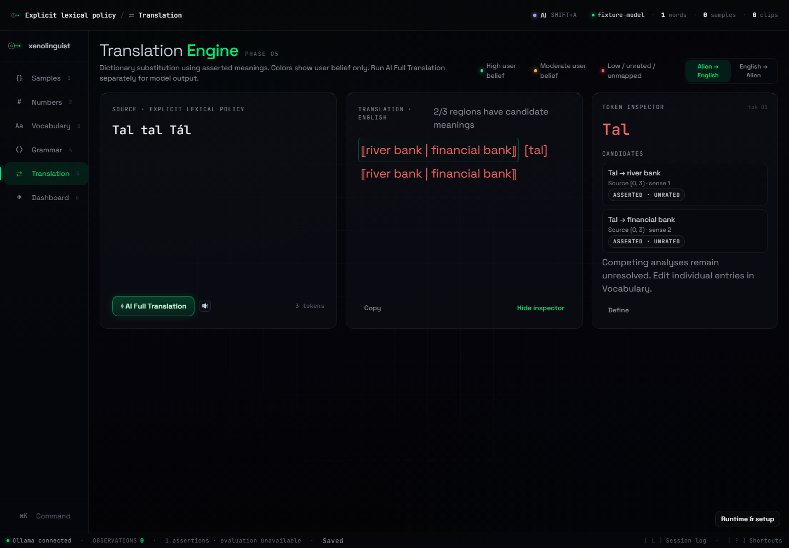

# Unicode lexicon and explicit senses

W16 replaces the workbench's Latin-only token cleaning with one lexical service shared by translation, sample inspection, vocabulary search and audio-label lookup. It is dictionary substitution with retained alternatives; it does not apply grammar or infer a language.

## Using it

In Vocabulary, open **Word matching settings** to choose case sensitivity, internal apostrophe/hyphen handling and segmentation. The settings belong to the profile and travel with JSON and project archives. Existing profiles default to case-insensitive lookup, internal apostrophes/hyphens and whitespace/punctuation boundaries.

New Entry and Edit include **Accepted forms and senses**:

- Alien form aliases are explicitly accepted alternative spellings, one per line.
- Each sense has one meaning and optional English phrase aliases, one per line.
- The display gloss remains editable and is preserved separately. `star / light` is not automatically converted into two senses.
- Without explicit senses, a display gloss is accepted as a whole reverse phrase. `to speak` matches that phrase; it does not map `to` or `speak` independently.
- With explicit senses, their meanings and accepted English aliases drive lookup. The display gloss becomes descriptive text rather than an additional reverse alias.

Translation and sample inspection display competing entries/senses together. Overlapping dictionary segments form an unresolved source region. Its inspector lists every candidate with its original span. A correction is permitted only when one analysis is selected by the lookup; competing entries must be edited individually in Vocabulary. Unknown words remain visible in brackets, including unknown scripts. Candidate-region coverage measures regions with recorded meanings, not semantic accuracy or word-level coverage.

## Text and offsets

`engine/src/text/normalize.ts` uses NFC for comparison. It preserves accents, case in stored text, punctuation spelling and the original source. Optional case-insensitive comparison uses Unicode `toLowerCase()` followed by NFC; it is not locale-sensitive collation, transliteration, accent stripping or full Unicode case folding. For example, `ß` and `ss` remain distinct, and dotted-I lowercase retains its combining dot. New forms only trim surrounding whitespace; the service normalizes both sides at lookup time.

Tokens and candidate edges carry half-open UTF-16 `[start, end)` offsets into the original JavaScript string. NFC length changes never become source offsets. `Intl.Segmenter` with grapheme granularity supplies source-safe boundaries, including astral letters, decomposed accents and combining IPA marks. Tokenization recognizes Unicode letters, marks and numbers. Whitespace and punctuation are retained as source tokens. An internal apostrophe (`'`, `’`, `ʼ`) or hyphen (`-`, `‐`, `‑`) joins letter/mark/number graphemes only when it has lexical neighbors. Other punctuation remains distinct.

Whitespace runs are equivalent inside a stored phrase during matching, so `to\n speak` can match `to speak`; the candidate still points at the original source span. Translation replaces matched spans with meanings and leaves unmatched whitespace/punctuation in place. Whitespace inside a replaced phrase is consumed by that phrase. Copy uses the same output as the display.

## Segmentation and ambiguity

Default mode uses spaces and punctuation as word boundaries. A saved `水` matches `水!`; a run `水火` is one unknown word unless that entire form is recorded. Users can supply spaces themselves.

Optional dictionary mode permits boundaries at graphemes within word runs, for any script. The trie returns **all** matching spans; it does not implement a general Chinese, Tamil or other script-specific word segmenter. With `水 = water`, `火 = fire` and `水火 = steam`, the region retains all three edges. The display `⟦水 → water | steam | 火 → fire⟧` describes candidate edges, not three complete sentence translations. Nested phrase aliases can likewise remain unresolved even when they refer to the same sense. No longest-match or first-record heuristic hides them.

Adjacent non-overlapping dictionary matches remain separate tokens. Output retains source spacing, so separate matches in unspaced input can produce adjacent glosses; the inspector supplies their boundaries. There is no probabilistic ranking, beam search, grammar disambiguation or calibrated confidence. User belief remains an assertion attached to each entry.

## Index and storage contracts

`engine/src/lexicon/index.ts` builds normalized form maps and forward/reverse token tries. Normal lookup traverses token keys rather than repeatedly scanning every dictionary entry. Search applies the same normalization to forms, display glosses, senses and aliases. Construction costs the total stored form/alias length; traversal is proportional to input length times maximum matching trie depth, plus emitted matches. Highly repetitive inputs with overlapping forms can still yield many candidates; this version makes no constant-time or large-corpus latency claim.

The weak cache is keyed by dictionary identity and checked against profile ID, revision and policy values. An immutable optimistic dictionary edit invalidates lookup before server revision acknowledgment. Closed profiles are eligible for garbage collection. Callers must replace dictionary objects for edits; mutating indexed entries in place is unsupported.

Optional `form_aliases`, `senses` and `lexical_policy` fields extend profile version 2. Missing fields preserve legacy behavior without parsing gloss punctuation or rewriting source text. A sense is a value object owned by its entry, so archive ID remapping does not invent independent sense identities. Each entry permits up to 64 senses/form aliases, with up to 64 aliases per sense and 512 characters per new sense/alias value. Blank senses and unknown policy values fail shared runtime validation. Existing unrestricted display glosses retain their prior contract. Older strict-schema applications may reject profiles containing these additive fields; preserve a backup when moving between versions.

## Verification

`npm run evaluate:unicode` replays 14 hand-authored, supplied-dictionary probes from `evaluation/fixtures/unicode-lexical.json`. Frozen W15 lookup returns the exact expected candidate set for **5/14**; repaired lookup returns it for **14/14**. The record includes all rows and source hashes. These regression results do not measure induction, compositional translation or performance on a natural-language corpus. W15's frozen adapters, corpus and published result archives remain unchanged.

Unit checks cover NFC/decomposed offsets, Han, Tamil, Cyrillic, IPA, astral letters, Hangul, numbers, unknown scripts, punctuation, case policy, phrase aliases, homographs, competing segmentation and cache invalidation. Integration checks cover typed mutations, disk reload, archive remapping and malformed-sense rejection. Browser checks exercise the actual panels, Unicode word creation, sense/alias editing, persisted case policy and reverse phrases. The independent installed-app harness additionally checks Unicode lookup, competing homographs, an explicit reverse alias and archive restoration.

Final revision `6081538` passes Windows/Linux source CI and independent Windows installer acceptance. [Retained verification](verification/w16-unicode-lexicon.json) includes both platforms’ lexical results, replay records and the installed application hash. See [implementation progress](implementation-progress.md) for the completed verification boundary. W17 will introduce executable typed grammar; it is not part of this change.

*Local acceptance flow for the final source: an explicit two-sense entry, its accented alias and a case-sensitive unknown. The synthetic profile uses a model-readiness fixture; this lookup makes no model request.*
